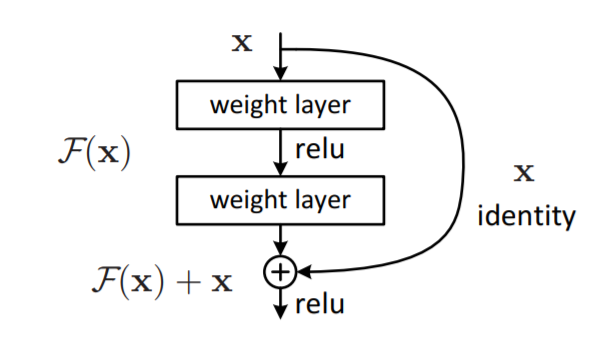
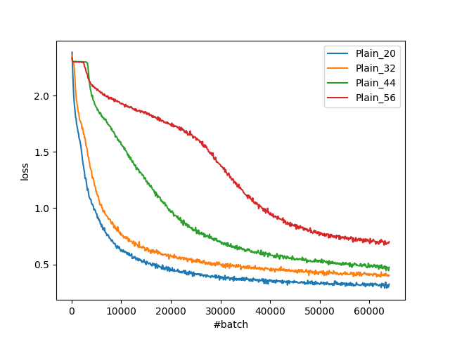
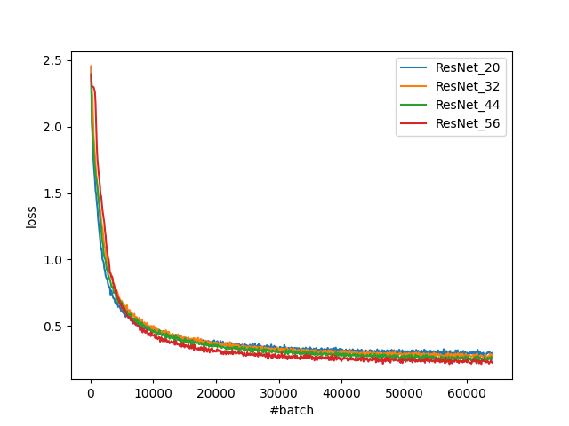

# ResNetを実装してみた
これば映像メディア学（2020）の期末課題です。

元の論文：[Deep Residual Learning for Image Recognition](https://openaccess.thecvf.com/content_cvpr_2016/papers/He_Deep_Residual_Learning_CVPR_2016_paper.pdf)

CVPR2016の論文です。

## 手法のまとめ
近年の画像分類のタスクでは、とても深い（層数の多い）ニューラルネットワークが使われる傾向がある。もちろん、深いニューラルネットワークはより高い表現力を持ち、より複雑な関数を近似できる。しかし、深いネットワークには深刻な問題がある。

- 勾配消失・勾配爆発問題
- 劣化問題

### 勾配消失・勾配爆発問題
層の数が多くなると、勾配消失と勾配爆発の問題が起こりやすくなる。
これらの問題が起こると、ネットワークは最初から収束出来なくなる。
この問題を解決するために、初期値の正規化や正規化レイヤーなどの手法が提案されている。
これらの手法を使うと、勾配消失や勾配爆発の問題を回避できる。

### 劣化問題
ネットワークの深さが深くなるに連れて、正確率が飽和し、そのあと急激に降下することがある。
この現象は劣化(degradation)と呼ばれている。劣化は過学習によって起こされるものだと考えられがちだが、実際はそうではない。劣化が発生したら、学習時のエラーも高くなってしまう。今回の論文が提案した残差ネットワーク(ResNet)はこの劣化問題を解決する手法である。

深いネットワークと浅いネットワークがあるとする。深いネットワークの冒頭の部分に浅いネットワークをコピーし、その後ろのすべての層を恒等写像にすれば、少なくとも浅いネットワークと同じ効果が得られるはずだ。しかし、これまでの最適化手法では、深いネットワークが浅いネットワークより悪い正確率を出すことが一般的である。現行の最適化手法は複数の非線形の層で恒等写像を近似することが苦手ではないかと、著者たちが述べた。

著者たちは深層残差学習(deep residual learning)を提案した。
ネットワークの幾つかの連続の層に直接学習してほしい写像${\cal H}({\bf x})$を学習させる代わりに、${\cal F}({\bf x}) = {\cal H}({\bf x}) - {\bf x}$を学習させる。つまり、元の写像は${\cal F}({\bf x}) + {\bf x}$で表すことができる。この残差を足すことで、ネットワークが最適されやすなることが実験によって証明された。この手法はshortcut connectionで図1のように簡単に実装できる（図1は元論文から引用したもの）。

||
|:--:|
|*図1　shortcut connection*|

もし最適な写像が恒等写像だったら、この残差学習を用いることで、ネットワークが簡単に最適化される（重み付き層を零写像にすればいい）。実際に、恒等写像が最適とは限らない。とは言っても、最適な写像が零写像より恒等写像に近い限り、残差学習の方が最適化されやすいはずだ。

## 実装
元の論文では、ResNetを用いてImageNetの画像分類を行った。それに加えれ、CIFAR-10でResNetとplain networksとの比較を行った。今回の期末課題では、計算資源を考慮して、後者のCIFAR-10での実験の一部を再現してみた。

ResNet及びplain networksの構造は元論文に従って実装した。
ネットワークの入力は32x32の画像で、最初の層は3x3の畳み込み層である。
続いて、2n層の32x32出力16チャンネルの畳み込み層、2n層の16x16出力32チャンネルの畳み込み層、2n層の8x8出力64チャンネルの畳み込み層がある。
最後に、平均プーリングと10出力の全結合層がある。
つまり、ネットワークは総計6n+2層から構成されている。
各層の後でバッチ正規化が行われ、正規化関数としてReLU関数が使われる。
ResNetでは、2層毎にshortcut connectionが行われている。但し、この二層の入力と出力のサイズが異なる場合、shortcut connectionが行われない。

実装する時、[このページ](https://pytorch.org/tutorials/beginner/blitz/cifar10_tutorial.html)を参考しました。

## 実験
n = [3, 5, 7, 9]、つまり層数 = [20, 32, 44, 56]のplain networks及びResNetを、バッチサイズ = 128で64kバッチ分学習させた。最適化手法はSGDで、weight decayが0.0001、momentumが0.9に設定された。学習率は初期0.1で、32kバッチと48kバッチが学習されたら0.01，0.001に変更された。データ拡張も行われた；各辺に4ピクセルをパッドし、ランダムに32x32に切り出し、0.5の確率で水平逆転する。

学習時のロスは図2と図3で示されている。最終のモデルのテストセットでの正確率は表1で示されている。

||
|:--:|
|*図2　Plain　Networksの学習時ロス*|

||
|:--:|
|*図3　ResNetの学習時ロス*|

||表1　テストセットでの正確率||
|:---:|:---:|:---:|
|層の総数|Plain Networks|ResNet|
|20|84.84%|82.66%|
|32|81.12%|85.62%|
|44|79.57%|86.02%|
|56|74.37%|87.03%|

## 考察
Plain networksでは、層数が多くなると、学習時のロスも大きくなり、ロスの降下の速度もゆっくりになることが見られた。つまり、ネットワークの深さによる劣化が確認出来た。一方、ResNetでは、ネットワークが深くなると最終のロスが小さくなることが見られた。しかし、層が深くなっても最適化の速度に影響がほとんどなかった。つまり、残差学習の手法は劣化の抑制に効果があることを確認できた。